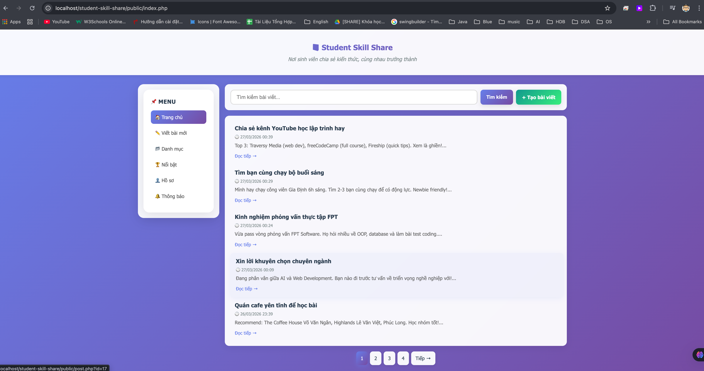
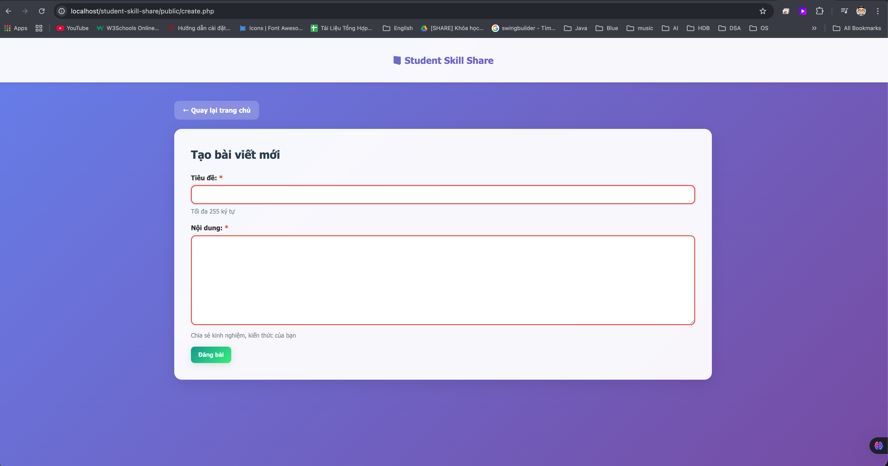
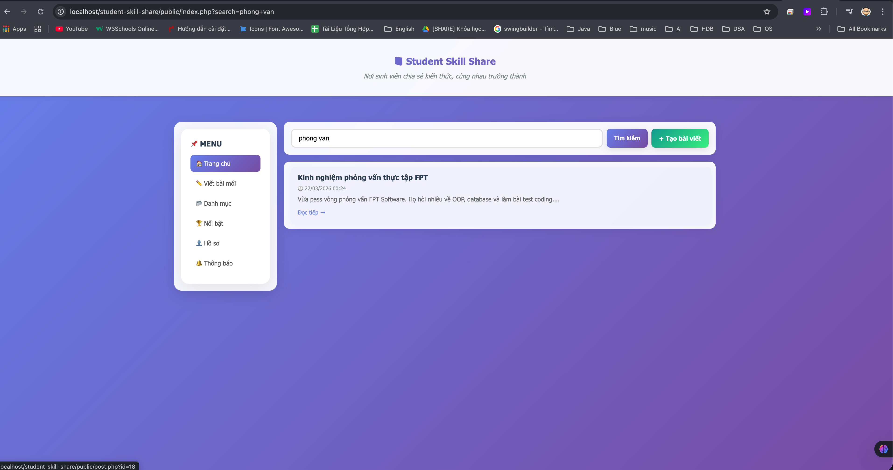

# 📸 Demo - Student Skill Share

> **MVP v1** | Cập nhật: 27/03/2026

---

## 🎯 Tổng quan

**Student Skill Share** - Nền tảng chia sẻ kỹ năng cho sinh viên, xây dựng bằng LAMP stack.

**Tech Stack:** PHP + MySQL + Apache + HTML/CSS/JS

---

## ✅ Tính năng hiện tại

- 📝 Tạo bài viết
- 📋 Xem danh sách (pagination 5 bài/trang)
- 📖 Xem chi tiết + comments
- 💬 Thêm bình luận
- 🔍 Tìm kiếm theo tiêu đề
- 🎨 UI hiện đại với toast notifications

---

## 🚧 Đang phát triển (MVP v2)

**Ưu tiên cao:**
- 👍 Like bài viết
- ✏️ Sửa/xóa bài viết
- 👤 User authentication
- 🔐 Authorization (phân quyền)

**Ưu tiên trung bình:**
- 📂 Categories & Tags
- 📊 Sort & Filter
- 📸 Upload images

---

## 📱 Screenshots

### 1. Trang chủ



**Chức năng:**
- Danh sách bài viết (5 bài/trang)
- Search bar
- Sidebar menu
- Pagination

---

### 2. Chi tiết bài viết


**Chức năng:**
- Nội dung đầy đủ
- Danh sách comments
- Form thêm comment
- Bài viết gợi ý (sidebar phải)

---

### 3. Tạo bài viết



**Chức năng:**
- Form tiêu đề + nội dung
- Validation
- Toast notification sau khi tạo

---

### 4. Tìm kiếm



**Chức năng:**
- Tìm theo tiêu đề
- Giữ keyword trong search box
- Pagination cho kết quả

---

## 🎨 Design Highlights

- **Colors:** Purple gradient (#667eea → #764ba2)
- **Effects:** Glassmorphism, backdrop blur
- **Layout:** 3-column grid (sidebar + main + sidebar)
- **Responsive:** Mobile-friendly
- **Animations:** Smooth transitions, hover effects

---

## 🚀 Quick Start

```bash
# 1. Import database
mysql -u root -p < database.sql

# 2. Start XAMPP (Apache + MySQL)

# 3. Truy cập
http://localhost/student-skill-share/public/index.php
```

---

## 📚 Tài liệu khác

- [Learning Guide](learning-guide.md) - Hướng dẫn học từng bước
- [Project Plan](project-plan.md) - Kiến trúc và kế hoạch
- [Check List](check-list.md) - Theo dõi tiến độ

---

**License:** MIT | **Version:** 1.0.0
